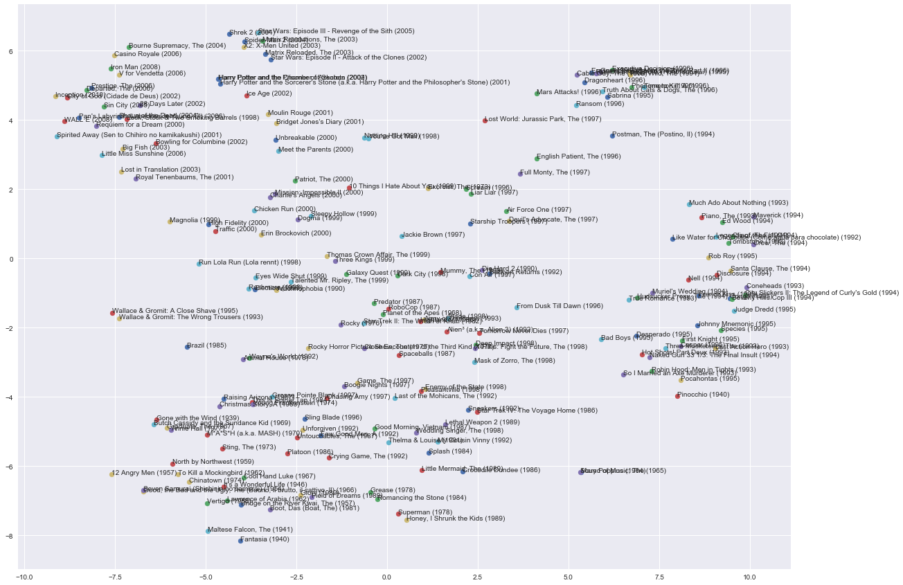

# Movie2vec
---

Item2Item style similarity ....

Skipgram model trained on [MovieLens 20 million ratings](https://grouplens.org/datasets/movielens/20m/) dataset using tensorflow. 

Check out [the notebook](notebook.ipynb)
